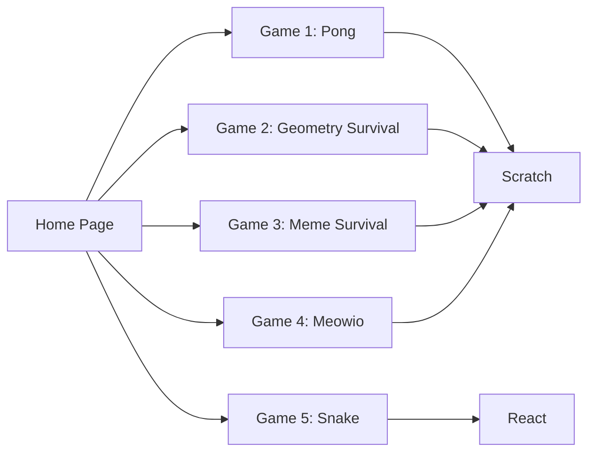

# 🎉 Games Showcase [](https://games-gold-nu.vercel.app/)

This NextJs App was built to display some basic games I built in highschool using nextjs hosted on vercel I hope you Enjoy!

1. 🏓 **Pong**
2. 📐 **Geometry Survival**
3. 😂 **Meme Survival**
4. 🐈 **Meowio**
5. 🐍 **Snake**


## 🚀 Getting Started

To get started, follow these steps:

1. Clone the repository:

   ```bash
   git clone https://github.com/ericdequ/games.git
   ```

2. Install the dependencies:

   ```bash
   cd games
   npm install --legacy-peer-deps
    ```

3. Run the development server:

   ```bash
   npm run dev
   ```

4. Open [http://localhost:3000](http://localhost:3000) with your browser to see the result.

5. Build the application for production:

   ```bash
   npm run build
   ```

## 🌐 Deployment

To deploy this app on Vercel, follow these steps:

1. Install the Vercel CLI:

   ```bash
   npm i -g vercel
    ```

2. Login to your Vercel account:

   ```bash
   vercel login
   ```

3. Initialize the project:

   ```bash
   vercel init
   ```

4. Deploy the app:

   ```bash
    vercel
    ```

5. Deploy the app to production:

   ```bash
   vercel --prod
   ```

## 🎮 Game Previews

### Game 1: Pong 🏓
The classic arcade game that started it all. Challenge yourself or play with a friend in this timeless masterpiece.

### Game 2: Geometry Survival 🔺
Dodge an endless onslaught of geometric shapes and obstacles in this fast-paced, addictive game.

### Game 3: Meme Survival 😂
Battle your way through the meme world, avoiding obstacles and collecting power-ups to survive.

### Game 4: Meowio 🐱
A knockoff of Mario but with Scratch Cat. Try to get to the end of the level and beat the boss!

### Game 5: Snake 🐍
The beloved classic Snake game, reimagined for modern browsers. Guide the snake to eat food and grow, but avoid hitting the walls or yourself!




## 📝 License
This project is licensed under the MIT License
